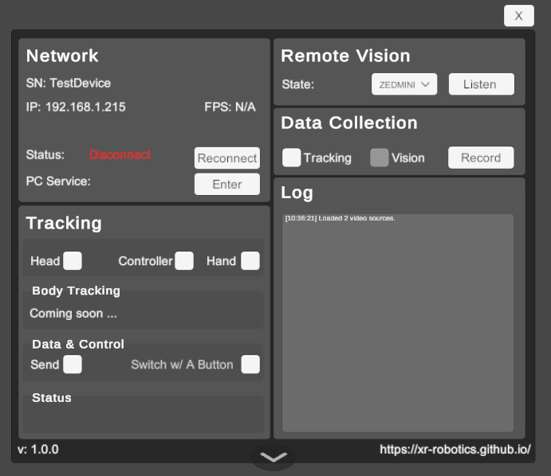

# XRoboToolkit-Unity-Client-Quest Project Documentation

> This is the corresponding Unity client for Quest headset of the [XRoboToolkit-Unity-Client](https://github.com/XR-Robotics/XRoboToolkit-Unity-Client).

> The corresponding Android project for networking, decoding, and rendering is [RobotVisionUnityPluginQuest
](https://github.com/XR-Robotics/RobotVisionUnityPluginQuest). 

## Project Overview
`XRoboToolkit-Unity-Client-Quest` is a Unity-based software developed for Quest devices to facilitate robot training and remote teleoperation. It works in conjunction with PC-side software to achieve robot training and teleoperation functionalities.

## Unity UI Main Panel Reference



| Item                                           | Description                                                                                  |
|------------------------------------------------|----------------------------------------------------------------------------------------------|
| Network - SN                                   | Display Serial number of the XR device, only functional with Pico 4 Ultra enterprise version |
| Network - IP                                   | IP address of the XR device                                                                  |
| Network - FPS                                  | Data syncing frames per second                                                               |
| Network - Status                               | Connection status between robot and XR device                                                |
| Network - PC Service                           | IP address of the PC running PC service                                                      |
| Network - Enter                                | Manually input the PC service's IP                                                           |
| Tracking - Head                                | Toggle On/Off to send out head 6 DoF pose                                                    |
| Tracking - Controller                          | Toggle On/Off to parse VR controller's 6 DoF pose and button status in data stream           |
| Tracking - Hand                                | Toggle On/Off to parse hand tracking data in data stream                                     |
| Tracking - Body Tracking                       | Body tracking for Quest. Coming soon ......                                                  |
| Tracking - Data & Control - Send               | Toggle On/Off to sync above selected poses between XR device and robot PC                    |
| Tracking - Data & Control - Switch w/ A Button | Toggle On/Off to rapid pause or resume sync with  the right-hand controller button A         |
| Tracking - Status                              | Panel to show tracking related information                                                   |
| Remote Vision - State                          | Show the state of camera, not available on Quest                                             |
| Remote Vision - Dropdown (Video Source)        | Select a supported video source                                                              |
| Remote Vision - Listen                         | Open a connection to receive the video stream to the selected video source                   |
| Data Collection - Tracking                     | Whether to record pose tracking data                                                         |
| Data Collection - Vision                       | Whether to record vision data, Not available yet                                             |
| Data Collection - Record                       | Start/Stop recording                                                                         |
| Log                                            | Show logs                                                                                    |

## Feature list
- **Pose sync between XR device and robot PC**
  Transmits pose data from the XR headset to the robot-side PC for robot teleoperation.
- **Local pose and stereo vision data collection**
  Synchronously records stereo vision and pose data collected from the XR headset, stored in the device's `/Download` directory.
- **Remote stereo vision sync between two XR headsets**
  Transmits stereo vision from the robot-side headset to operator-side for 3D display.
- **Remote stereo vision sync between PC camera and XR headset**
  Transmits stereo vision from the robot-side PC camera to operator-side headset for 3D display.
## Feature instructions

### Pose sync between XR device and robot PC
1. Connect robot PC and Quest under the same network
2. On robot PC, run service:
    - **Windows**: Run `\Program Files (x86)\roboticsservice\runService.bat`
    - **Linux (Ubuntu/Debian x86)**: Run `/opt/apps/roboticsservice/runService.sh`
3. Open app XRoboToolkit-Quest on Quest headset

If the PC service is running successfully, when you open the app on Quest headset, you will receive a prompt window for server connection. Point to the IP address and click it with the trigger button on the controller.

On the main panel, select preferred pose information to be synced, such as head tracking, controller tracking, or body tracking. If your headset and PC have established connection, then the pose data will be synced to PC when "Send" is toggled On. When "Switch w/ A Button" option toggles On, you may also use "A" button on the right controller to toggle "Send" On or Off during data syncing.

### Local pose data collection

On the main panel, select preferred pose data to be collected, click Record. Record button will turn red. When you finish recording, press Record button again to end the collection session. You may find the recorded data from the Log panel.

### Remote stereo vision sync from PICO 4U to Quest 

1. Connect both XR headsets to the same network.
2. Make sure that PICO 4U has VST camera permission (requires special approval).
3. Open **XRRoboToolkit** on PICO 4U, open **XRoboToolkit-Quest** on Quest.
4. PICO 4U: Remember the IP of the VR headset and **DON'T DO ANYTHING**.
5. Quest: On the Camera panel, Select **PICO4U** as the video source, Click Listen, input PICO 4U's IP, and click Confirm.
6. H2: You should now be able to see the live camera. Press B button on the right-hand controller to switch between side-by-side views and stereo-3D views.
7. H2: If you close the live camera window, you can simply repeat Step 5.
8. If you want to stop the camera streaming, quit the App on both sides.

### Remote stereo vision sync from ZED camera (Orin) to Quest

1. Clone [XRoboToolkit-Orin-Video-Sender](https://github.com/XR-Robotics/XRoboToolkit-Orin-Video-Sender.git) on Orin.
2. Build
3. Run the following command on Orin:
   ```bash
   ./OrinVideoSender --listen <IP of Orin>:13579
   ```
4. Open **XRRoboToolkit-Quest** on Quest.
5. On the Camera panel, select "ZEDMINI" as the video source.
6. Click "Listen", input the IP of Orin, and click Confirm.
7. You should now be able to see the live camera. Press B button on the right-hand controller to switch between side-by-side views and stereo-3D views.
8. If you close the live camera window, you can simply repeat Step 6.
9. If you want to stop the camera streaming, quit **XRRoboToolkit-Quest** on the XR headset and stop the OrinVideoSender on Orin.

## Project Configuration

### Environment Requirements
- Unity 2021.3.45f1
- Meta XR Interaction SDK 72.0.0 (com.meta.xr.sdk.interaction.ovr)
- Oculus XR Plugin 3.4.1 (com.unity.xr.oculus)

**Important Notes**:
1. Use exact Unity version 2021.3.45f1 to avoid compatibility issues
2. Complete Android module installation during Unity setup

### Architecture Overview
- **Cross-Platform Hybrid Architecture**:
  Unity C# layer and Android Java layer communicate via JNI bridge for hardware-accelerated decoding and rendering.

- **Dual Data Channels**:
    - Video Stream: 60 FPS with adaptive QoS
    - Pose Data Channel: 90Hz with low-latency priority

- **Thread Model**:
  | Thread Type          | Responsibilities                          |
  |----------------------|-------------------------------------------|
  | Main Thread          | UI rendering & user input handling        |
  | Worker Thread        | Video decoding/network transmission       |
  | GL Thread            | OpenGL OES texture operations             |

- **Key Performance Metrics**:
  | Metric                     | Value                        |
  |----------------------------|------------------------------|
  | End-to-End Latency          | ~100ms (720P *2 @60FPS)     |
  | Pose Data Packet Size       | 56 bytes/frame              |

---

### Known Issues

- Unity Compatibility

The App will occasionally crash when built with Unity 2022.3. This is because of **Null Pointer Dereference**. [[Reference](https://discussions.unity.com/t/unity-2020-null-pointer-dereference/873518)]

- XR Plugin Issues

The texture won't be updated when switching the XR Plugin-in Management from Oculus to OpenXR. The networking and decoding are working, but not the displaying.

- Unity XR Interaction Toolkit and XR Hands 

Because of the incompatible OpenXR plugin, the XR Interaction Toolkit(com.unity.xr.interaction.toolkit) and XR Hands(com.unity.xr.hands) are not supported in this project.

### Q&A

- Q: Failed to connect on Linux.

A: Ensure the PC and headset are in the same WiFi network. Run the 3D application first and then run the Headset App.

- Q: How to update the video source?

A: Do the following steps:
```bash
# pull the file first
adb pull /sdcard/Android/data/com.xrobotoolkit.client.quest/files/video_source.yml
# edit the video_source.yml
# push the file back
adb push video_source.yml /sdcard/Android/data/com.xrobotoolkit.client.quest/files/video_source.yml
```

- Q: How to revert the video source to default?

A: Run `adb shell rm /sdcard/Android/data/com.xrobotoolkit.client.quest/files/video_source.yml`.

---

For technical support or documentation updates, contact the development team.

### Citation

If you find this project useful, please consider citing it as follows.

```
@article{zhao2025xrobotoolkit,
      title={XRoboToolkit: A Cross-Platform Framework for Robot Teleoperation}, 
      author={Zhigen Zhao and Liuchuan Yu and Ke Jing and Ning Yang}, 
      journal={arXiv preprint arXiv:2508.00097},
      year={2025}
}
```
